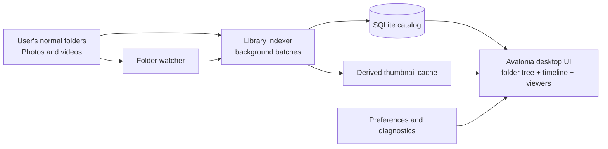

# PicNest design document

**Status:** Living document  
**Last updated:** 2026-07-23  
**Audience:** PicNest maintainers and contributors

## 1. Purpose

PicNest is a private, desktop photo and video library inspired by what made Picasa useful: normal folders remain the source of truth, browsing is fast, and the main screen is a timeline of real life. It is intended for a personal collection that can grow to hundreds of thousands of photos and videos without requiring a cloud account or proprietary file format.

PicNest complements Windows Explorer; it does not replace it. The application catalogs media in folders chosen by the user and never imports, renames, or relocates original files during normal library work.

## 2. Product principles

1. **Folder-first.** Imported folders are ordinary filesystem folders. The user can browse them in Explorer at any time.
2. **Local-first and private.** Cataloging, thumbnailing, playback, face grouping, and future AI search run on the PC. No library data is uploaded by default.
3. **Instant-feeling browsing.** Responsive scrolling and cached thumbnails matter more than elaborate visual effects.
4. **Metadata is additive.** Albums, favorites, captions, faces, and tags enrich files without taking ownership of them.
5. **Recoverable by design.** Losing the catalog or thumbnail cache must never lose original media. A rescan can rebuild the derived data.
6. **Useful without configuration.** Adding one folder should quickly make that part of the library browsable while the rest of the work continues in the background.

## 3. Scope

### Current capabilities

- Import and manage one or more folder roots.
- Discover subfolders and image/video files; refresh manually and react to filesystem changes.
- Show a Windows Explorer-like folder tree and a date-grouped, virtualized thumbnail timeline.
- Search filenames and captions; filter by folder, favorites, albums, and people.
- View images with zoom, pan, rotation, and next/previous navigation.
- Play local videos using embedded LibVLC controls and generated video thumbnails.
- Create albums, mark favorites, select several files, copy/move/delete them, and reveal a file in Explorer.
- Offer local face detection/grouping and nameable people groups.
- Protect chosen roots behind an app-only password and provide light/dark preferences, slideshow options, and configurable diagnostic/cache locations.

### Explicit non-goals

- Cloud synchronization, accounts, advertising, or mandatory vendor services.
- Moving a whole photo library into an opaque application-owned store.
- Treating the app-only protected-folder feature as encryption or Windows access control.
- A full digital-asset-management workflow for professional teams in the first releases.

## 4. High-level architecture



The original files are independent of PicNest. SQLite, cached thumbnails, preferences, and logs are local application data that can be recreated or restored separately.

## 5. Storage model

### Original media

Media stays where the user put it, for example:

```text
D:\Pictures\
  2026\
    2026_07_19\
      IMG_1234.jpg
      climb-session.mp4
```

PicNest stores an absolute path for each record and treats that path as an external resource. File operations are always explicit user actions.

### Local application data

By default, derived data is stored under `%LOCALAPPDATA%\PicNest`:

| Location | Contents | Can be rebuilt? |
| --- | --- | --- |
| Catalog database | SQLite records for roots, media, albums, tags, people, and face scans | Mostly; user-created metadata should eventually be backed up |
| Thumbnail cache | Derived image and video preview files | Yes |
| `diag\picnest.log` | Local diagnostic log | Yes; history only |
| Preferences | Theme, locations, slideshow settings, and protected-folder verifier | Settings can be re-entered; protected roots need their password |

The preferences dialog can redirect the diagnostic and thumbnail locations. The catalog remains local and is never a replacement for the source files.

### Catalog schema

SQLite is the catalog source of truth. The key entities are:

| Entity | Purpose |
| --- | --- |
| `LibraryRoots` | Imported top-level folders and whether a root is app-protected |
| `Photos` | Path, folder, date, hash, dimensions, media kind, thumbnail path, and favorite flag |
| `Albums` / `AlbumPhotos` | User-created virtual collections without moving files |
| `Tags` | Per-photo tags |
| `People` | Name metadata associated with a photo |
| `FacePeople`, `FaceScans`, `DetectedFaces` | Local face-grouping data and scan state |

Indexes should favor the normal UI paths: folder, date, normalized path, favorite status, album membership, and person membership. Schema evolution must be migration-based and backward compatible with an existing local catalog.

## 6. Indexing and change detection

### First import

Adding a root returns control to the folder-management dialog promptly. A background indexing job then:

1. Enumerates folders and supported media files.
2. Creates or updates folder-tree records.
3. Reads basic file data and creates a stable content/hash record.
4. Writes catalog changes in bounded batches (currently 250 records per transaction).
5. Generates a derived thumbnail for each image or video.
6. Publishes progress and refreshed groups to the UI without blocking scrolling.

Supported video extensions include MP4, MOV, MKV, AVI, M4V, WMV, WebM, MTS/M2TS, and 3GP. Unsupported or unreadable files are logged and do not stop a scan.

### Refresh and watchers

Refresh reconciles the catalog with the filesystem: it finds new subfolders and media, updates changed items, and removes catalog entries for files or folders that no longer exist. Folder watchers handle later creates, changes, renames, and deletions. Watcher events must be treated as hints; a refresh remains the correct reconciliation mechanism when events are dropped, a root is offline, or a large copy operation occurs.

### Thumbnail policy

Thumbnails are a disposable performance cache. Their filename must be derived from a stable media identity/path and thumbnail version so that a stale cache can be invalidated when the renderer changes. Generation is constrained by background work limits; the UI must never decode full-resolution originals merely to populate a scrolling grid.

## 7. User interface design

The primary layout follows Picasa's successful shape:

```text
+-----------------------------------------------------------+
| App identity, search, library / albums / people            |
+-----------------------------------------------------------+
| Manage folders | refresh | album | thumbnail size | prefs  |
+----------------+------------------------------------------+
| Quick access   | Date-grouped virtual thumbnail timeline   |
| Albums         |  Jul 19                                   |
| People         |  [media] [media] [media]                  |
| Folder tree    |                                            |
+----------------+------------------------------------------+
| Status and contextual selection actions                    |
+-----------------------------------------------------------+
```

The timeline is virtualized: only items near the viewport have visual containers and decoded thumbnail images. Thumbnail size choices are small, medium, and large. Date grouping should prefer capture date once EXIF/XMP handling is complete; file date is the current safe fallback.

The image viewer owns image navigation, zoom, mouse-wheel zoom, panning while enlarged, reset, and rotation. Video playback uses an embedded LibVLC component in the viewer rather than starting an external player.

## 8. Organization and metadata

Favorites are a fast, single-click view across all visible imported roots. Albums are virtual collections, so a photo can appear in more than one album without a duplicated file. Selection actions operate on the actual filesystem only after a clear user command; deletion uses the Windows Recycle Bin where possible.

Face recognition is local and optional. It should separate three stages:

1. Detect faces and store a representative crop/feature record.
2. Cluster likely matches conservatively.
3. Let the user assign or correct a person name.

No person name or face data leaves the computer. The user must be able to delete face data and rescan.

## 9. Privacy and protection

PicNest's privacy model is "nothing is uploaded." Network access is not required for normal catalog, viewer, video, face, or slideshow functionality.

Protected folders are an application-level privacy feature. A PBKDF2 password verifier is stored locally; plaintext passwords are not stored. When locked, protected roots are hidden from normal PicNest navigation. This does **not** encrypt the source folder or prevent someone with Windows/Explorer access from opening it. Users who need strong protection should use BitLocker, encrypted volumes, or Windows account permissions in addition to PicNest.

## 10. Reliability, diagnostics, and recovery

`picnest.log` contains structured, readable blocks with timestamp, level, source function/line, and message. At minimum, scans and discovery of new directories or media are logged. Errors should include the media path when it is safe to record it, plus a concise reason and exception type.

The expected recovery path is:

1. Preserve the original folders.
2. Export or back up the SQLite catalog when metadata matters.
3. If thumbnails or the catalog are damaged, rebuild the derived cache and rescan roots.
4. Use a refresh after an interrupted copy/move or a disconnected drive returns.

## 11. Performance targets

The design target is a 100,000-plus item personal library on typical desktop hardware.

| Area | Design response |
| --- | --- |
| Initial scan | Background worker, batched SQLite writes, incremental UI updates |
| Large timeline | Virtualized item containers and a bounded decoded-image cache |
| Thumbnail work | Persistent derived cache; no repeat decoding after a restart unless invalidated |
| Database reads | Indexed, paged queries rather than loading the complete library into memory |
| File changes | Watcher hints plus explicit refresh reconciliation |
| Video | Compact generated preview plus on-demand LibVLC playback |

Performance work must be measured against real collections, including mixed portrait/landscape images, phone videos, long paths, disconnected roots, duplicates, and large folders. The target user experience is responsive browsing while indexing continues, not necessarily a completed full scan before the first thumbnail is shown.

## 12. Roadmap

### Near term

- Complete capture-date extraction from EXIF/XMP, with a clear fallback order.
- Improve video metadata, duration display, scrub previews, and failure reporting.
- Add a catalog backup/export and restore flow for albums, favorites, captions, and people.
- Improve face-cluster review: merge, split, ignore, and delete controls.
- Add duplicate/near-duplicate detection as a review workflow, never an automatic deletion workflow.

### Later, optional local intelligence

- Semantic image/video search using locally generated embeddings.
- Perceptual duplicate clusters and best-shot selection.
- OCR-backed search for screenshots and documents.
- Project collections that can include photos, videos, PDFs, and maker artifacts alongside normal media.

Any AI feature remains opt-in, local by default, cancellable, and removable from the catalog.

## 13. Engineering guardrails

- Keep original media immutable during indexing.
- Make potentially destructive actions explicit, reviewable, and recoverable.
- Prefer a simple SQLite migration over a second data store unless a measured requirement justifies one.
- Keep UI work on the UI thread; perform scanning, hashing, thumbnailing, and face processing off it.
- Bound concurrency, memory usage, and decoded image caches.
- Add diagnostics around background jobs and external media libraries.
- Test light and dark themes, Windows path edge cases, inaccessible folders, empty folders, and files deleted during a scan.

This document should be updated whenever a user-visible architecture decision changes.
